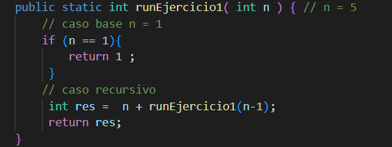
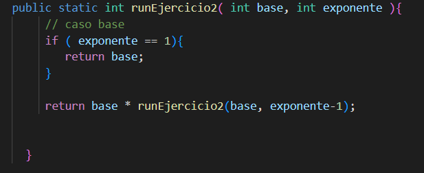

# Práctica:  Ejercicios de recursividad 

## Datos del Estudiante
- **Nombre:** Miguel Maza
- **Curso:** Computacion grupo 1
- **Fecha:** 15/6/2026

---
## 1. Ejercicio 1 

**Fecha:** 15/6/2026

**Descripción:** Se diseñaron diferentes ejercicios aplicando la recursividad para entender la recurdividad.

**Ejercicio1**

**Ejercicio2**

